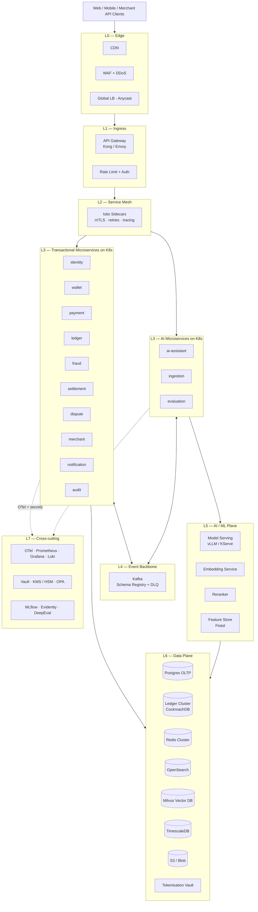
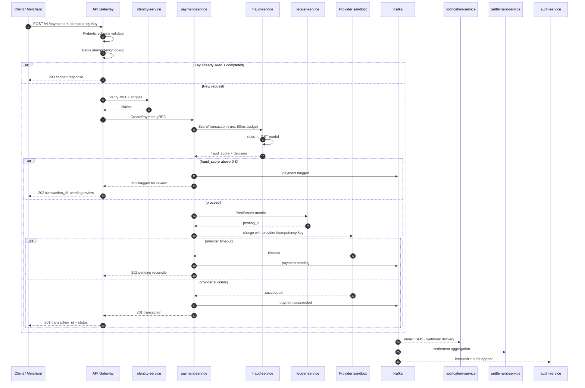
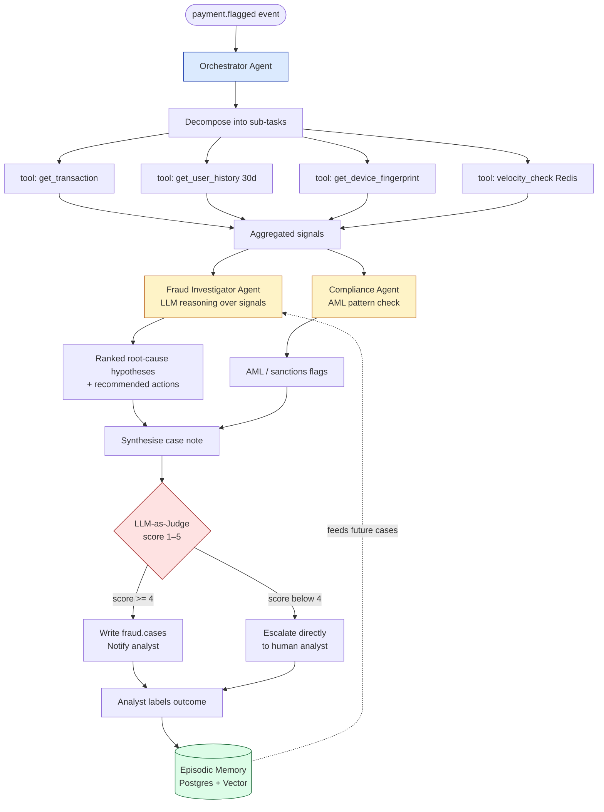
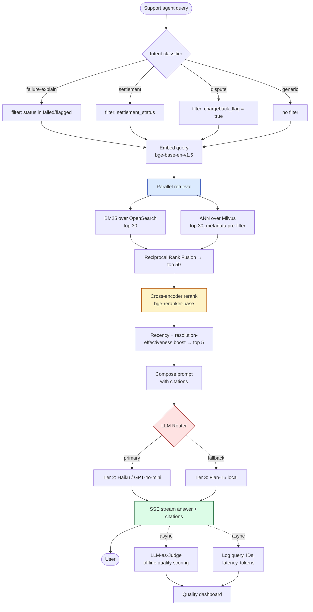
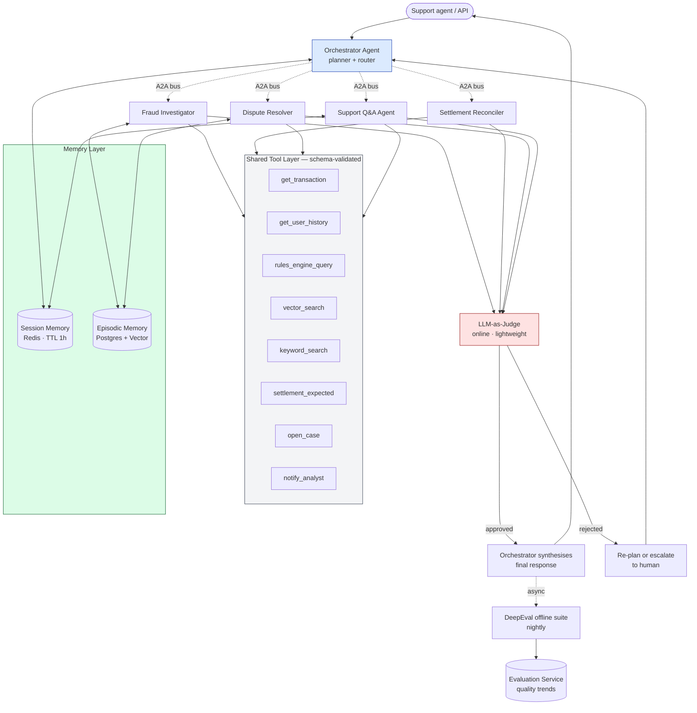

# AI-Powered Payment Gateway — Architecture Diagrams

**Companion file to:** `ARCHITECTURE_REVIEW.md`
**Purpose:** All architectural diagrams in Mermaid. Render natively in GitHub, GitLab, Notion, VS Code preview, and Confluence (with plugin).

> **Reading the diagrams:** Solid arrows are synchronous calls. Dotted arrows are asynchronous / observational. Subgraphs represent deployment or logical groupings, not network boundaries unless labelled as such.

---

## 1. High-Level Architecture

The eight-layer production architecture from `ARCHITECTURE_REVIEW.md §3`. Layers are stacked top-down — each layer depends only on layers below it.



---

## 2. Payment Flow

End-to-end happy path with the synchronous critical section (steps 1–11) and the asynchronous tail (steps 12+). Failure handling is shown as alt branches.



---

## 3. Fraud Analysis Flow

This is the **asynchronous** investigation that runs after `payment.flagged`. The synchronous fraud score in §2 step 5 is rules + GBT only — no LLM blocks the money path.



---

## 4. RAG Flow

Hybrid retrieval with reciprocal rank fusion, cross-encoder rerank, and recency boost. This is the flow behind `POST /v1/assistant/query`.



---

## 5. Agent Communication Flow

The hierarchical multi-agent topology with A2A messaging, shared tool layer, dual memory, and LLM-as-judge gating.



---

## 6. Azure Deployment Flow

The production architecture mapped onto concrete Azure services. Multi-region active-active with `Central India` as primary and `South India` as the warm pair (data-residency-friendly).

```mermaid
flowchart TB
    Users(["Users · Merchants · Mobile"])

    subgraph AzEdge["Azure Edge — Global"]
        AFD["Azure Front Door<br/>Global LB + CDN + WAF"]
        DDoS["Azure DDoS Protection<br/>Standard"]
    end

    subgraph Primary["Primary Region — Central India"]
        direction TB

        subgraph Ingress["Ingress"]
            APIM["API Management<br/>Premium tier"]
            AppGW["Application Gateway<br/>L7 + WAF"]
        end

        subgraph AKS["AKS Cluster — multi-AZ"]
            direction TB
            Istio["Istio Service Mesh"]

            subgraph TxNS["namespace: transactional"]
                direction LR
                IDp[identity]
                PAp[payment]
                LEp[ledger]
                FRp[fraud]
                SEp[settlement]
                DIp[dispute]
                Otherp[wallet · merchant · notif · audit]
            end

            subgraph AINS["namespace: ai"]
                direction LR
                AIp[ai-assistant]
                INp[ingestion]
                EVp[evaluation]
            end
        end

        subgraph DataAz["Data Services"]
            direction LR
            PGFlex[("Azure DB for PostgreSQL<br/>Flexible Server")]
            CosmosPg[("Azure Cosmos DB for PG<br/>Ledger cluster")]
            ARedis[("Azure Cache for Redis<br/>Enterprise")]
            ASearch[("Azure AI Search<br/>BM25 + vector hybrid")]
            ABlob[("Azure Blob Storage<br/>audit + artifacts")]
            ADX[("Azure Data Explorer<br/>time-series metrics")]
        end

        subgraph Messaging["Messaging"]
            EH["Event Hubs<br/>Kafka surface"]
            SB["Service Bus<br/>scheduled + DLQ"]
        end

        subgraph AIServices["AI Services"]
            AOAI["Azure OpenAI<br/>GPT-4o · 4o-mini"]
            MLW["Azure ML Workspace<br/>local model endpoints"]
            MLflow["MLflow on Azure ML"]
        end

        subgraph Sec["Security & Identity"]
            direction LR
            Entra["Microsoft Entra ID<br/>workload identity"]
            B2C["Entra External ID<br/>customer identity"]
            KV["Azure Key Vault"]
            HSM["Azure Managed HSM<br/>PCI tokenisation"]
        end

        subgraph Obs["Observability"]
            direction LR
            AppIns["Application Insights<br/>OTel ingest"]
            LAW["Log Analytics Workspace"]
            Monitor["Azure Monitor + Alerts"]
            MGrafana["Azure Managed Grafana"]
        end
    end

    subgraph Secondary["Secondary Region — South India · active-active"]
        AKS2["AKS Cluster<br/>identical workloads"]
        Data2[("Geo-replicated<br/>data services")]
    end

    Users --> AFD
    AFD --> DDoS
    DDoS --> APIM
    APIM --> AppGW
    AppGW --> Istio
    Istio --> TxNS
    Istio --> AINS

    TxNS --> PGFlex
    TxNS --> ARedis
    LEp --> CosmosPg

    TxNS <--> EH
    AINS <--> EH
    Otherp <--> SB

    AINS --> ASearch
    AINS --> AOAI
    AINS --> MLW
    INp --> ABlob
    EVp --> MLflow

    AKS -. workload identity .-> Entra
    AKS -. secrets via CSI .-> KV
    PAp -. tokenise PAN .-> HSM
    Users -. OIDC login .-> B2C

    AKS -. OTel .-> AppIns
    AppIns --> LAW
    LAW --> Monitor
    Monitor --> MGrafana

    PGFlex -. geo-replicate .-> Data2
    CosmosPg -. multi-region writes .-> Data2
    EH -. Geo-DR pairing .-> Secondary
    AKS -. GitOps · ArgoCD / Flux .-> AKS2

    style AFD fill:#0078d4,color:#fff,stroke:#004578
    style AKS fill:#0078d4,color:#fff,stroke:#004578
    style AKS2 fill:#0078d4,color:#fff,stroke:#004578
    style AOAI fill:#0078d4,color:#fff,stroke:#004578
    style PGFlex fill:#0078d4,color:#fff,stroke:#004578
    style CosmosPg fill:#0078d4,color:#fff,stroke:#004578
    style EH fill:#0078d4,color:#fff,stroke:#004578
```



### Azure service mapping (cheat sheet)

| Architectural concept | Azure service | Tier / SKU notes |
|---|---|---|
| Global edge + WAF | Azure Front Door Premium + DDoS Standard | Premium for managed WAF rules |
| API gateway | Azure API Management Premium | Premium for VNet integration + multi-region |
| L7 + regional WAF | Application Gateway v2 + WAF | Behind APIM for VNet ingress to AKS |
| Compute | AKS, multi-AZ node pools | Separate node pools for `transactional` and `ai` |
| Service mesh | Istio (AKS managed add-on) | mTLS, retries, traffic shifting |
| OLTP database | Azure Database for PostgreSQL — Flexible Server | HA-enabled, zone-redundant |
| Ledger database | Azure Cosmos DB for PostgreSQL (Citus) | Distributed; isolation from OLTP |
| Cache + sessions + idempotency | Azure Cache for Redis Enterprise | Active geo-replication |
| Hybrid search | Azure AI Search | Native vector + BM25 in one service |
| Vector DB alternative | Milvus on AKS | Choose if AI Search ranking quality is insufficient |
| Event log | Event Hubs (Kafka protocol) | Geo-DR pairing |
| Task queue / DLQ | Azure Service Bus | Scheduled messages for webhook retries |
| Object storage | Azure Blob Storage + Lifecycle | Cool + Archive tiers for audit retention |
| Time-series metrics | Azure Data Explorer (Kusto) | Sub-second analytics over tx volumes |
| LLM provider | Azure OpenAI | Data residency, PTU for latency-sensitive |
| Local model serving | Azure ML managed endpoints | For Flan-T5 fallback + embedding service |
| Experiment tracking | Azure ML + MLflow | Native MLflow integration |
| Workload identity | Microsoft Entra ID + AKS workload identity | No secrets in pods |
| Customer identity | Microsoft Entra External ID (B2C) | Social + email + MFA |
| Secrets | Azure Key Vault + CSI driver | Auto-rotation |
| Tokenisation / PCI keys | Azure Managed HSM | FIPS 140-2 Level 3 |
| Tracing + logs + metrics | App Insights + Log Analytics + Managed Grafana | OTel-native ingestion |
| GitOps deployment | Flux or ArgoCD on AKS | Drives multi-region parity |

---

## How to render these

- **GitHub / GitLab:** renders automatically in markdown previews.
- **VS Code:** install "Markdown Preview Mermaid Support" extension.
- **Confluence:** install "Mermaid Diagrams for Confluence" plugin.
- **PowerPoint export:** use `mmdc` CLI (`@mermaid-js/mermaid-cli`) to export to PNG / SVG / PDF before pasting into slides.

```
npm install -g @mermaid-js/mermaid-cli
mmdc -i DIAGRAMS.md -o diagrams.pdf
```
