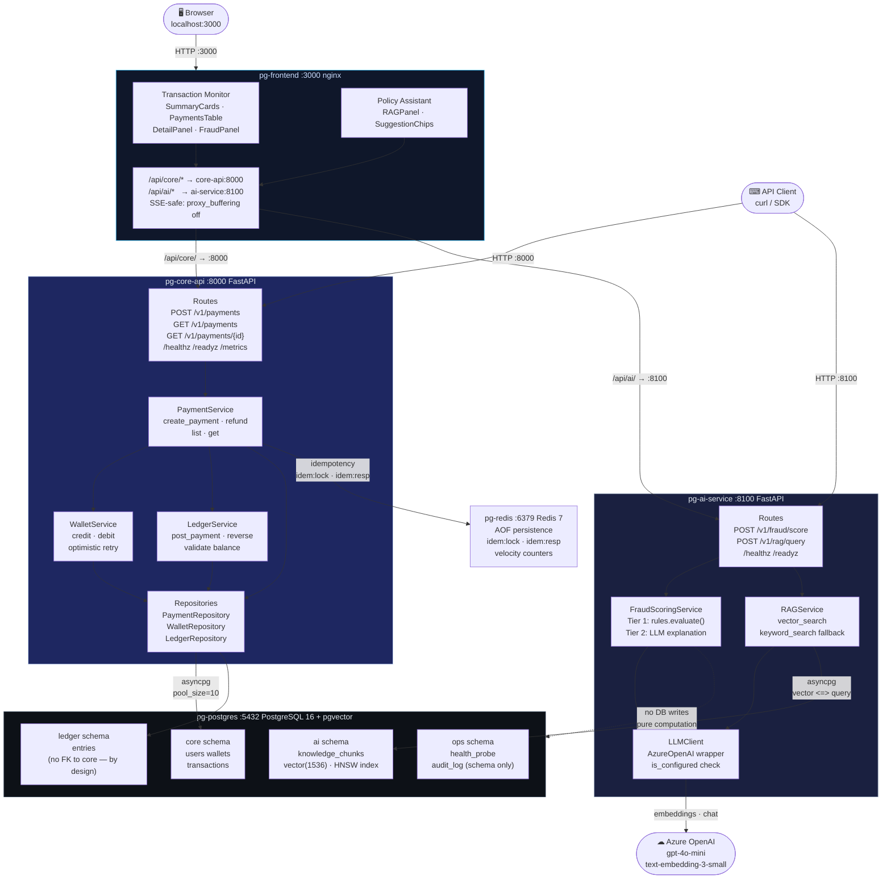
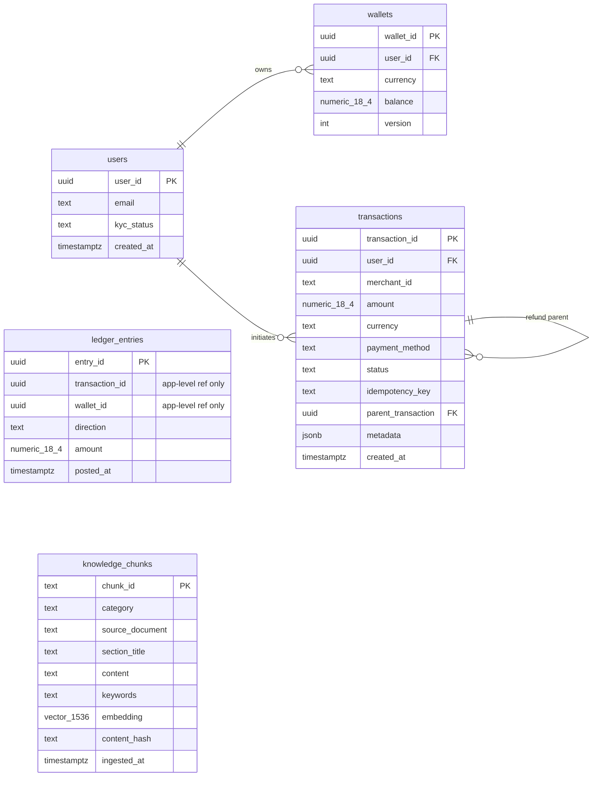
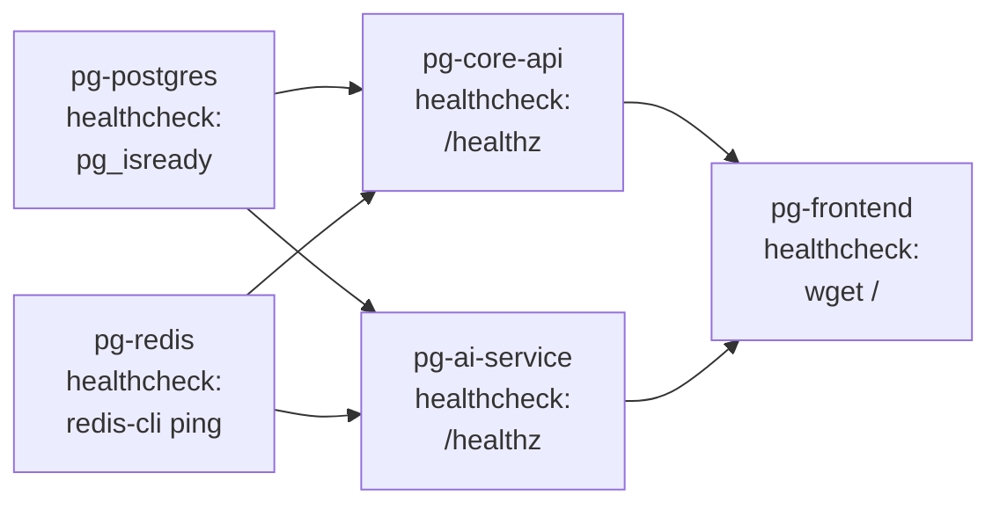
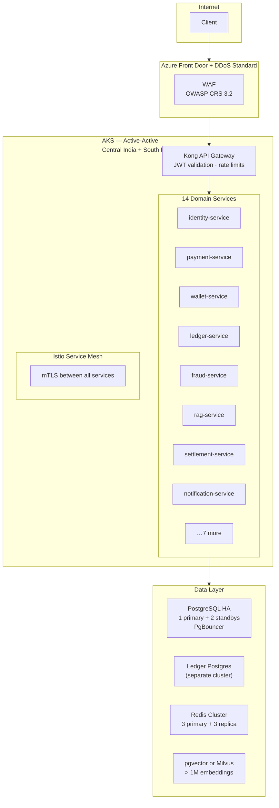

# End-to-End Data Flow Diagram
## AI-Powered Payment Gateway Platform

**Companion documents:** `PAYMENT_FLOW.md` · `FRAUD_SCORING_FLOW.md` · `RAG_RETRIEVAL_FLOW.md`

---

## System Architecture Overview

Five containers on a private bridge network (`pg-net`). Only ports 3000, 8000, and 8100 are exposed to the host. Postgres and Redis are reachable only from the other containers via service-DNS names.

```
Host machine
├── :3000  pg-frontend  (React + nginx)
├── :8000  pg-core-api  (FastAPI)
├── :8100  pg-ai-service (FastAPI)
│
│   [internal — not exposed to host]
├── :5432  pg-postgres  (PostgreSQL 16 + pgvector)
└── :6379  pg-redis     (Redis 7)
```

---

## Mermaid Diagram — Full System Data Flow



---

## Database Schema Boundaries



**Schema isolation principles:**

- `ledger.entries` has **no FK to `core.transactions`** — preserves the extraction path to a dedicated ledger Postgres cluster (ADR-006)
- `ai.knowledge_chunks` has **no relation to the payment domain** — AI service reads only from the `ai` schema
- The `ops` schema is a namespace placeholder for audit logs and feature flags; no application data lives there

---

## Container Startup Order



`depends_on` with `condition: service_healthy` ensures:
1. Postgres and Redis are accepting connections before either API service starts
2. Both API services are returning 200 on `/healthz` before the frontend starts
3. The frontend never proxies to a not-yet-ready backend

---

## Request Routing — Detailed

### Frontend proxy (nginx)

| Browser path | nginx directive | Internal destination |
|---|---|---|
| `/` (SPA) | `try_files $uri $uri/ /index.html` | React static bundle |
| `/api/core/v1/payments` | `proxy_pass http://core-api:8000/v1/payments` | core-api payment routes |
| `/api/ai/v1/fraud/score` | `proxy_pass http://ai-service:8100/v1/fraud/score` | ai-service fraud route |
| `/api/ai/v1/rag/query` | `proxy_pass http://ai-service:8100/v1/rag/query` | ai-service RAG route |

The AI proxy adds `proxy_buffering off`, `proxy_cache off`, `Connection ''`, and `chunked_transfer_encoding off` — the four directives required for correct SSE (Server-Sent Events) streaming in future agent phases.

### Direct API access

```
curl :8000/v1/payments          # bypasses nginx; hits core-api directly
curl :8100/v1/fraud/score       # bypasses nginx; hits ai-service directly
```

Both are valid for development and demo; the frontend always uses the nginx proxy paths (`/api/core/*`, `/api/ai/*`).

---

## Data Flow — Payment Creation (condensed)

```
Browser → nginx :3000
  → proxy_pass core-api:8000
    → FastAPI route: validate Pydantic
      → Redis: GET idem:resp:{key}          # idempotency fast-path
        → PaymentService.create_payment()
          → WalletRepository: SELECT wallet
          → PaymentRepository: INSERT pending
          → WalletRepository: UPDATE balance WHERE version=N
          → LedgerRepository: INSERT 2 entries (DEBIT + CREDIT)
          → PaymentRepository: UPDATE status=success
        → AsyncSession.commit()
      → Redis: SET idem:resp:{key}          # prime replay cache
    → 201 Created { transaction_id, status: "success", … }
← 201 Created
```

---

## Data Flow — Fraud Scoring (condensed)

```
Browser (Detail drawer) → nginx :3000
  → proxy_pass ai-service:8100
    → FastAPI route: validate Pydantic
      → FraudScoringService.score()
        → rules.evaluate()                  # Tier 1: ~1ms, no I/O
          → 15 rule functions → raw_score → decision
        → FraudScoringService._explain()    # Tier 2: best-effort
          → asyncio.wait_for(LLM call, 3s)
          → on success: LLM one-sentence explanation (llm_used=true)
          → on failure: template explanation (llm_used=false)
    → 200 OK { risk_score, decision, rule_hits, explanation, … }
← 200 OK (always, regardless of LLM availability)
```

---

## Data Flow — RAG Retrieval (condensed)

```
Browser (Policy Assistant) → nginx :3000
  → proxy_pass ai-service:8100
    → FastAPI route: validate Pydantic
      → RAGService.query()
        → if llm.is_configured:
            asyncio.wait_for(embeddings.create(query), 5s)
            → vector <=> HNSW query → cosine scores [0,1]
            → search_mode=vector, embedding_used=true
          else / timeout:
            SELECT chunks + Dice-coefficient scoring
            → search_mode=keyword, embedding_used=false
    → 200 OK { chunks[], search_mode, embedding_used, … }
← 200 OK (always, regardless of embedding availability)
```

---

## Network Isolation

```
╔══════════════════════════════════════════════════════════╗
║  pg-net  (bridge)                                        ║
║                                                          ║
║  pg-postgres:5432   ←── core-api (asyncpg pool_size=10)  ║
║                     ←── ai-service (asyncpg)             ║
║                                                          ║
║  pg-redis:6379      ←── core-api (redis.asyncio)         ║
║                     ←── ai-service (redis.asyncio)       ║
║                                                          ║
║  pg-core-api:8000   ←── pg-frontend (nginx proxy)        ║
║  pg-ai-service:8100 ←── pg-frontend (nginx proxy)        ║
╚══════════════════════════════════════════════════════════╝
         ↕ exposed to host
    :3000 (frontend)
    :8000 (core-api)
    :8100 (ai-service)
```

Postgres (:5432) and Redis (:6379) are **not** exposed to the host in production configuration. They are accessible on the host in this local development setup for direct database inspection; in a production Kubernetes deployment they would be Cluster-internal services only.

---

## Production Target Architecture

The production architecture documented in `Docs/Evaluation/PRODUCTION_READINESS.md` evolves this five-container stack into a 14-service Kubernetes deployment:



Every domain package in the current codebase corresponds to exactly one production service. The extraction path is a `git mv` + new `Containerfile` + updated `Deployment` manifest — the code does not change.
