# Fraud Scoring Flow
## AI-Powered Payment Gateway Platform

**Companion documents:** `PAYMENT_FLOW.md` · `RAG_RETRIEVAL_FLOW.md` · `DATA_FLOW_DIAGRAM.md`

---

## Overview

The fraud scoring pipeline for `POST /v1/fraud/score` is a two-tier architecture designed around one inviolable principle: **the fraud decision must never depend on LLM availability**.

- **Tier 1** — 15 deterministic rule functions run synchronously in < 1 ms, always, with no external I/O. They produce `risk_score`, `decision`, and `rule_hits`.
- **Tier 2** — an Azure OpenAI LLM call attempts to generate a natural-language explanation. It has a 3-second hard timeout. On any failure (timeout, rate limit, misconfiguration), a deterministic template fills in. The `llm_used: bool` field tells callers which path ran.

The route returns the same fields regardless of which path executes. Callers do not need to handle a "LLM unavailable" error — they always receive a complete, usable response.

---

## Mermaid Diagram — Fraud Scoring Pipeline

```mermaid
flowchart TD
    A([Client sends\nPOST /v1/fraud/score]) --> B[FastAPI route\napp/fraud/routes.py]

    B --> C{Pydantic v2\nvalidation}
    C -- invalid --> CE([422 Unprocessable\napplication/problem+json])
    C -- valid --> D[FraudScoringService\n.score&#40;req&#41;]

    subgraph TIER1["Tier 1 — Deterministic Rule Engine  &lt; 1ms  · ALWAYS runs"]
        direction TB
        D --> E[rules.evaluate&#40;req&#41;]
        E --> E1[AMOUNT_LARGE_INR\nAMOUNT_LARGE_USD_EUR\nAMOUNT_ROUND_SUSPICIOUS]
        E --> E2[VELOCITY_PRIOR_FAILURES\nVELOCITY_HIGH_FREQ\nVELOCITY_NEW_ACCOUNT]
        E --> E3[GEO_HIGH_RISK_COUNTRY\nGEO_CROSS_BORDER]
        E --> E4[METHOD_BANK_LARGE\nMETHOD_CARD_FOREIGN]
        E --> E5[MERCHANT_HIGH_RISK_CAT\nMERCHANT_NEW_NO_HISTORY]
        E --> E6[BEHAVIOUR_ODD_HOUR\nBEHAVIOUR_NEW_DEVICE\nBEHAVIOUR_METADATA_SPARSE]
        E1 & E2 & E3 & E4 & E5 & E6 --> SCORE[raw_score = min&#40;Σ weights, 100&#41;\nSort hits by weight desc]
        SCORE --> DEC{Decision\nthresholds}
        DEC -- "score &lt; 40" --> ALLOW[decision = allow]
        DEC -- "40 ≤ score &lt; 75" --> REVIEW[decision = review]
        DEC -- "score ≥ 75" --> REJECT[decision = reject]
    end

    ALLOW & REVIEW & REJECT --> TIER2START[Decision committed\nBefore LLM call]

    subgraph TIER2["Tier 2 — LLM Explanation  Best-effort  · 3s timeout"]
        direction TB
        TIER2START --> LLMCheck{Azure OpenAI\nconfigured?}
        LLMCheck -- no --> TMPL[Template explanation\nllm_used = false]
        LLMCheck -- yes --> LLMCall[chat.completions.create\ngpt-4o-mini · temperature=0.2\nmax_tokens=120]
        LLMCall -- success --> LLMOk[LLM explanation\nllm_used = true]
        LLMCall -- timeout > 3s --> TMPL
        LLMCall -- error/quota --> TMPL
    end

    LLMOk & TMPL --> RESP[Build FraudScoreResponse\nrisk_score · decision · reasons\nrule_hits · explanation\nmodel_version · llm_used · scored_at]

    RESP --> Z([200 OK\napplication/json])

    style TIER1 fill:#1e2761,color:#cadcfc,stroke:#cadcfc
    style TIER2 fill:#1a2040,color:#94a3b8,stroke:#334155
```



---

## Step-by-Step Narrative

### HTTP Boundary

`POST /v1/fraud/score` in `services/ai-service/app/fraud/routes.py` receives the request body. FastAPI deserialises it into `FraudScoreRequest`. Pydantic validators:

- `amount` — rejects `float`; accepts `Decimal`, `int`, or decimal string. Raises `ValueError` on `amount ≤ 0`.
- `currency` — auto-uppercased; must be exactly 3 ASCII letters.
- `payment_method` — must be one of `card | bank_transfer | wallet | upi`.

A 422 with `application/problem+json` is returned immediately on validation failure. The rule engine is never called.

The route constructs `FraudScoringService(llm=llm)` from the dependency-injected `LLMClient` and delegates to `service.score(req)`.

---

### Tier 1 — Rule Engine

`rules.evaluate(req)` in `services/ai-service/app/fraud/rules.py` runs all 15 registered rules. Rules are decorated with `@_rule`, which appends them to the `_RULES` list at module import time. Adding rule 16 requires only writing a function and applying the decorator.

**Rule contract:** every rule is a pure function `(FraudScoreRequest) -> RuleHit | None`. `None` means the rule did not fire. No shared mutable state, no external I/O, no async.

**Scoring:**

```python
hits = [rule(req) for rule in _RULES if rule(req) is not None]
hits.sort(key=lambda h: h.weight, reverse=True)   # highest impact first
raw_score = min(sum(h.weight for h in hits), 100)
```

**Decision thresholds** (module-level constants — one edit recalibrates the entire pipeline):

```python
THRESHOLD_REVIEW: Final[int] = 40   # score >= this → review
THRESHOLD_REJECT: Final[int] = 75   # score >= this → reject
```

### The 15 Rules

| Category | Rule ID | Weight | Fires when |
|---|---|---|---|
| amount | `AMOUNT_LARGE_INR` | 25–40 | INR amount ≥ ₹1,00,000 |
| amount | `AMOUNT_LARGE_USD_EUR` | 20–35 | USD/EUR amount ≥ $10,000 |
| amount | `AMOUNT_ROUND_SUSPICIOUS` | 15 | Exact multiple of ₹50k / ₹1L / ₹5L / ₹10L |
| velocity | `VELOCITY_PRIOR_FAILURES` | 10–35 | `metadata.prior_failures` ≥ 2 |
| velocity | `VELOCITY_HIGH_FREQ` | 20–35 | `metadata.txns_last_hour` ≥ 5 |
| velocity | `VELOCITY_NEW_ACCOUNT` | 15–25 | Account age ≤ 30 days AND amount above threshold |
| geo | `GEO_HIGH_RISK_COUNTRY` | 30 | `metadata.country_receiver` on FATF-aligned list |
| geo | `GEO_CROSS_BORDER` | 10 | Sender and receiver in different non-risk countries |
| method | `METHOD_BANK_LARGE` | 20 | Bank transfer above INR ₹5L / USD $50k |
| method | `METHOD_CARD_FOREIGN` | 15 | Card country ≠ merchant country |
| merchant | `MERCHANT_HIGH_RISK_CAT` | 30 | Merchant ID starts with gambling/crypto/forex prefix |
| merchant | `MERCHANT_NEW_NO_HISTORY` | 20 | `metadata.merchant_txn_count` ≤ 5 |
| behaviour | `BEHAVIOUR_ODD_HOUR` | 12 | `metadata.hour_of_day` between 02:00 and 05:00 local |
| behaviour | `BEHAVIOUR_NEW_DEVICE` | 20–30 | `metadata.is_new_device` is true |
| behaviour | `BEHAVIOUR_METADATA_SPARSE` | 8 | Fewer than 2 of {device_id, ip_address, country} present |

**Score cap:** `min(Σ weights, 100)`. A pile-on of all 15 rules at maximum weights (which exceeds 250) is safely capped. Verified across 10,000 synthetic test cases — maximum observed score: 100.

---

### Tier 2 — LLM Explanation

`FraudScoringService._explain()` is called after the decision is committed. It attempts the LLM path inside `asyncio.wait_for(..., timeout=_LLM_TIMEOUT)`.

**LLM prompt structure:**

```
SYSTEM: You are a concise fraud risk summariser. Always respond with exactly one sentence.

USER:  Summarise this payment fraud assessment in ONE sentence for a risk analyst:
       Transaction: {currency} {amount} via {payment_method} to merchant {merchant_id}.
       Risk score: {score}/100. Decision: {decision}.
       Key signals: {top_3_rule_hits}
       Be factual and concise. Do not add caveats or recommendations.
```

`temperature=0.2` keeps hallucination minimal. `max_tokens=120` prevents verbose output.

**Fallback conditions** (all produce `llm_used: false`):

| Condition | How detected |
|---|---|
| Azure OpenAI not configured | `llm.is_configured == False` checked before call |
| Timeout (> 3 seconds) | `asyncio.TimeoutError` caught |
| API error / rate limit | Any `Exception` from `client.chat.completions.create` |

**Template explanation format:**

```
"The transaction scored {score}/100 and has been {cleared/flagged/rejected}
primarily due to: {top_rule_reason} [and N other signals]."
```

---

## Response Schema

```json
{
  "transaction_id": "uuid",
  "user_id": "uuid",
  "risk_score": 42,
  "decision": "review",
  "reasons": [
    "Merchant 'm_gambling_xyz' is in a category with elevated chargeback rates.",
    "Transaction initiated at 03:xx local time (unusual activity window 02:00–05:00)."
  ],
  "rule_hits": [
    {
      "rule_id": "MERCHANT_HIGH_RISK_CAT",
      "category": "merchant",
      "weight": 30,
      "reason": "Merchant 'm_gambling_xyz' is in a category with elevated chargeback rates.",
      "evidence": { "merchant_id": "m_gambling_xyz", "matched_prefix": "m_gambling" }
    },
    {
      "rule_id": "BEHAVIOUR_ODD_HOUR",
      "category": "behaviour",
      "weight": 12,
      "reason": "Transaction initiated at 03:xx local time (unusual activity window 02:00–05:00).",
      "evidence": { "hour_of_day": 3 }
    }
  ],
  "explanation": "The transaction was flagged for review because the merchant operates in a category with elevated chargeback rates and the payment was initiated at 3 AM.",
  "model_version": "deterministic-v1+llm-explain",
  "llm_used": true,
  "scored_at": "2026-06-22T08:15:30.123456+00:00"
}
```

**Key points:**
- `reasons` is a flat string list parallel to `rule_hits` — convenient for display without iterating the full hit objects
- `rule_hits` are sorted **descending by weight** — the most impactful signal is always first
- `evidence` contains the raw values that triggered the rule — this is the audit trail
- `model_version` is a stable string incremented when rule weights or thresholds change

---

## Latency Breakdown

```
< 1ms    rules.evaluate()       — 15 pure functions, no I/O
~ 2ms    _score_to_decision()   — threshold comparison
~350ms   LLM explanation call   — Azure OpenAI round-trip (optional)
   0ms   Template fallback      — deterministic string concatenation

Total with LLM:       ~350–700ms (varies by API latency)
Total without LLM:    < 5ms
```

**Production SLO target:**
- Rules-only path: P99 < 10ms
- LLM path: P99 < 2s (3s hard timeout protects the SLA)

---

## Graceful Degradation Summary

```
Azure OpenAI available + within timeout
    → Tier 1 runs → Tier 2 runs → llm_used: true
    → Full explanation from LLM

Azure OpenAI not configured
    → Tier 1 runs → Tier 2 skipped → llm_used: false
    → Template explanation generated

Azure OpenAI configured but timeout / error
    → Tier 1 runs → Tier 2 times out → llm_used: false
    → Template explanation generated
    → Warning logged: fraud_llm_explain_timeout

In ALL cases:
    → risk_score is always correct
    → decision is always correct
    → rule_hits are always complete
    → explanation is always a non-empty string
    → HTTP 200 is always returned
```
