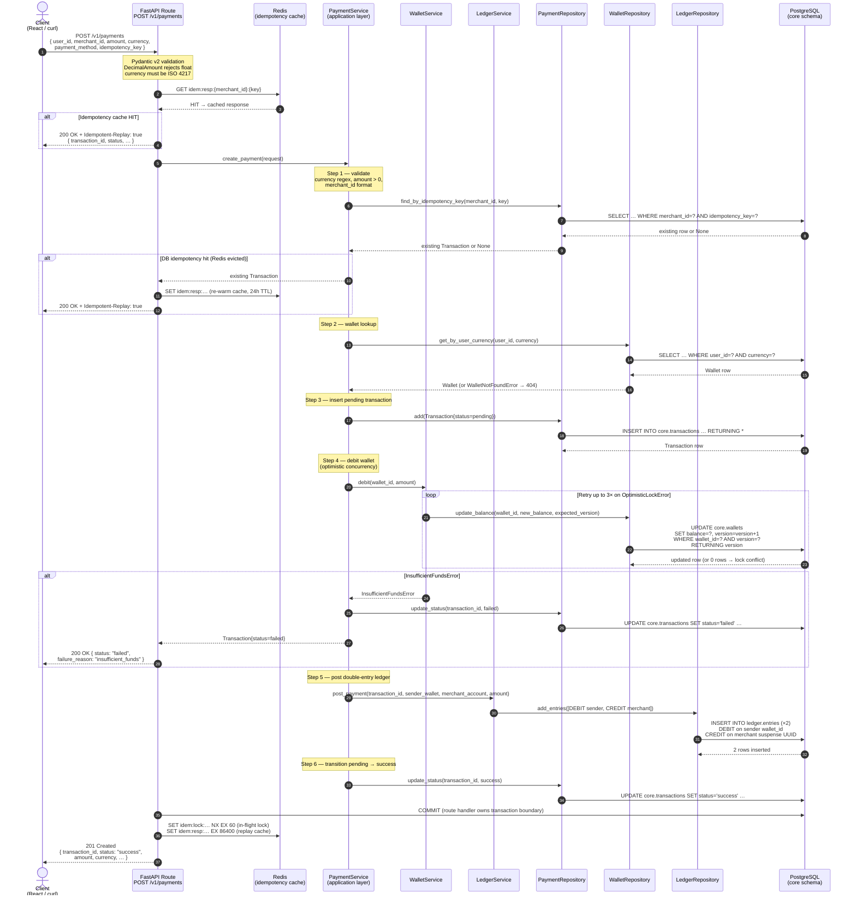
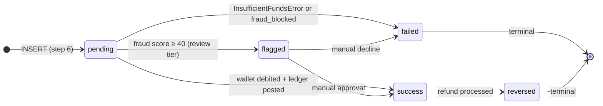

# Payment Processing Flow
## AI-Powered Payment Gateway Platform

**Companion documents:** `FRAUD_SCORING_FLOW.md` · `RAG_RETRIEVAL_FLOW.md` · `DATA_FLOW_DIAGRAM.md`

---

## Overview

A payment request enters the system through the React dashboard or directly via the REST API and traverses four distinct layers — HTTP boundary, application service, repository, and database — before a response is returned. The flow is strictly sequential to preserve correctness: each step either commits or aborts the entire operation.

**Key invariants enforced by this flow:**

- A wallet can never go negative (`CHECK(balance >= 0)` in Postgres + service-layer guard)
- Every successful payment produces exactly 2 ledger entries; failed payments produce 0
- The same `(merchant_id, idempotency_key)` pair always returns the same `transaction_id`
- The `Money` column type rejects `float` at the Python layer; amounts travel as decimal strings in JSON

---

## Mermaid Diagram — End-to-End Payment Flow



---

## Step-by-Step Narrative

### Step 1 — HTTP Boundary and Pydantic Validation

The request reaches `POST /v1/payments` in `services/core-api/app/payment/api/routes.py`. FastAPI deserialises the JSON body into `CreatePaymentRequest` (Pydantic v2). The `DecimalAmount` validator rejects `float` inputs with a clear error message — `99.99` as a JSON number is rejected; `"99.99"` as a string is accepted. Currency is validated against a 3-letter uppercase ISO 4217 regex.

The `Idempotency-Key` request header is preferred over the body field. If both are present and differ, a 422 is returned immediately.

### Step 2 — Redis Idempotency Fast Path

Before calling the service, the route handler checks `idem:resp:{merchant_id}:{key}` in Redis. A cache hit means this exact request has already been processed. The cached response is returned immediately as HTTP 200 with the `Idempotent-Replay: true` header. The payment service and database are never touched.

**Why Redis before the DB?** The Redis check adds ~2ms but avoids 4 Postgres round-trips on replay. The DB `UNIQUE(merchant_id, idempotency_key)` constraint is the correctness backstop, not the primary check.

### Step 3 — Application Service Entry

`PaymentService.create_payment()` in `services/core-api/app/payment/application/service.py` is the orchestrator. It receives the validated request and runs all business logic. The service layer **never commits** — the route handler owns the SQLAlchemy `AsyncSession` commit boundary, giving free atomicity across the wallet, ledger, and transaction writes.

### Step 4 — DB Idempotency Fallback

`PaymentRepository.find_by_idempotency_key()` queries the `UNIQUE(merchant_id, idempotency_key)` index. This path is taken only when the Redis cache has been evicted (e.g., after a Redis restart). Finding an existing row re-warms the Redis cache and returns 200.

### Step 5 — Wallet Lookup

`WalletRepository.get_by_user_currency()` fetches the sender's wallet for the requested currency. If no wallet exists for that (user, currency) pair, `WalletNotFoundError` is raised and mapped to a 404.

### Step 6 — Insert Pending Transaction

A `Transaction` row is inserted with `status=pending` before any money moves. This is the audit artefact — if the system crashes between here and the wallet debit, the pending row is visible for reconciliation.

### Step 7 — Debit Wallet (Optimistic Concurrency)

`WalletService.debit()` calls `WalletRepository.update_balance()`:

```sql
UPDATE core.wallets
   SET balance = :new_balance, version = version + 1
 WHERE wallet_id = :wallet_id
   AND version   = :expected_version
RETURNING version
```

Zero rows returned means another concurrent request already updated this wallet. The service retries up to 3 times with the freshly-read version. After 3 failures, `ContentionExceededError` is raised and mapped to a 503.

If `new_balance < 0`, `InsufficientFundsError` is raised before the UPDATE executes. The transaction is marked `failed` and returned as HTTP 200 — the failed-transaction row is an audit artefact we keep.

### Step 8 — Post Double-Entry Ledger

`LedgerService.post_payment()` writes exactly 2 rows to `ledger.entries`:

| Entry | Direction | Account |
|---|---|---|
| 1 | `DEBIT` | Sender's `wallet_id` |
| 2 | `CREDIT` | Merchant's deterministic suspense UUID (`uuid5(MERCHANT_NS, merchant_id)`) |

The `ledger` schema has **no foreign key to `core.transactions`** by design (ADR-006). This preserves the extraction path: moving the ledger to a separate Postgres cluster requires only a connection-string change, not a schema migration.

The service validates `sum(debits) == sum(credits)` before writing. An empty entries list raises `EmptyPostingError`.

### Step 9 — Status Transition and Commit

`PaymentRepository.update_status()` transitions `pending → success` (or `pending → failed` on insufficient funds). The service layer enforces the state machine via `_ALLOWED_TRANSITIONS`; illegal transitions raise `InvalidStateTransitionError` before any DB write.

The route handler then calls `session.commit()`. If any previous step raised an exception and was not caught, the `finally` block in `get_session()` rolls back the session — atomicity at no extra cost.

### Step 10 — Redis Cache Write

After a successful commit, the route handler sets:

- `idem:lock:{merchant_id}:{key}` — `NX EX 60` (60-second in-flight deduplication lock)
- `idem:resp:{merchant_id}:{key}` — serialised response, `EX 86400` (24-hour replay cache)

HTTP 201 is returned to the client.

---

## State Machine



**Terminal states** (`failed`, `reversed`) have empty transition sets. Any attempt to move a transaction out of a terminal state raises `InvalidStateTransitionError` at the service layer. The PostgreSQL ENUM enforces the *set* of valid values; the service enforces the *sequence*.

---

## Error Responses (RFC 7807)

| Scenario | HTTP status | `type` | Notes |
|---|---|---|---|
| Validation failure (bad amount, etc.) | 422 | `validation-error` | Pydantic error detail |
| Wallet not found | 404 | `wallet-not-found` | Enumeration-safe (same 404 for auth failure) |
| Insufficient funds | 200 | — | `status: "failed"` in response body |
| Idempotency key mismatch | 422 | `idempotency-key-mismatch` | Header ≠ body |
| High contention (wallet lock) | 503 | `contention-exceeded` | After 3 retries |
| Duplicate key race (rare) | 409 | `duplicate-transaction` | Concurrent same-key requests |

---

## Idempotency Layers

```
Request with Idempotency-Key
        │
        ▼
┌─────────────────────────────────────────┐
│ Layer 1: Redis idem:resp:*  (24h TTL)   │ ← fastest (~2ms); evicted on restart
│  HIT  → return cached response, 200     │
└─────────────┬───────────────────────────┘
              │ MISS
              ▼
┌─────────────────────────────────────────┐
│ Layer 2: DB UNIQUE(merchant_id, key)    │ ← durable; survives Redis eviction
│  HIT  → re-warm Redis, return 200       │
└─────────────┬───────────────────────────┘
              │ MISS
              ▼
        Normal create_payment() flow
```
